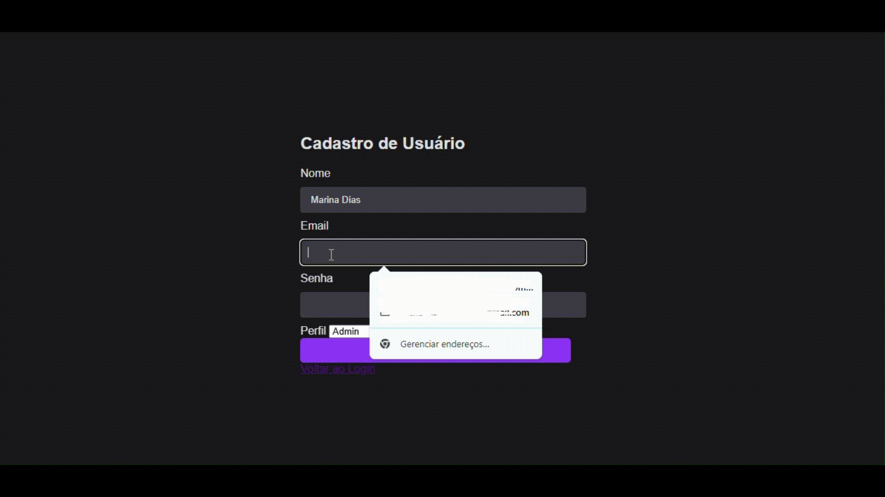

## PROJETO CADLOG SYSTEM!

# Índice

[Gif Demonstrativo](#-projeto-cadlog-system-)  
[Descrição](#-descri%C3%A7%C3%A3o)  
[Funcionalidade](#funcionalidade)  
[Tecnologias utilizadas](#tecnologias-utilizadas)  
[Fontes consultoras](#fontes-consultadas)  
[Autores](#autores)  

## ⬇ Descrição
Um projeto de ultimo trimestre, aonde temos que fazer com principalmente php, uma tela de cadastro, login, registro de usuários e a parte administrativa dos novos usuários. 

# 🛒 Projeto CadLog System 🛒

## 👌Funcionalidade
Com o admin podendo editar ou excluir informações de usuário, para qualquer erro cometido incluso, ou para apenas a exclusão de tal cliente ou funcionário.

### 💖Tecnologias utilizadas
- `CSS3` 
- `HTML5`
### Versão do VSCODE
- Version: 1.71.0 (system setup)
- Commit: 784b0177c56c607789f9638da7b6bf3230d47a8c
- Date: 2022-09-01T07:36:10.600Z
- Electron: 19.0.12
- Chromium: 102.0.5005.167
- Node.js: 16.14.2
- V8: 10.2.154.15-electron.0
- OS: Windows_NT x64 10.0.22631
- Sandboxed: No
## 🥰Fontes consultadas

* [Alura](https://www.alura.com.br/artigos/escrever-bom-readme) - Como escrever um README incrível
* [Github](https://gist.github.com/lohhans/f8da0b147550df3f96914d3797e9fb89) - Um modelo para fazer um bom README.md

## 😍Autores
* [Marsh](https://github.com/MarshyyUWU)
